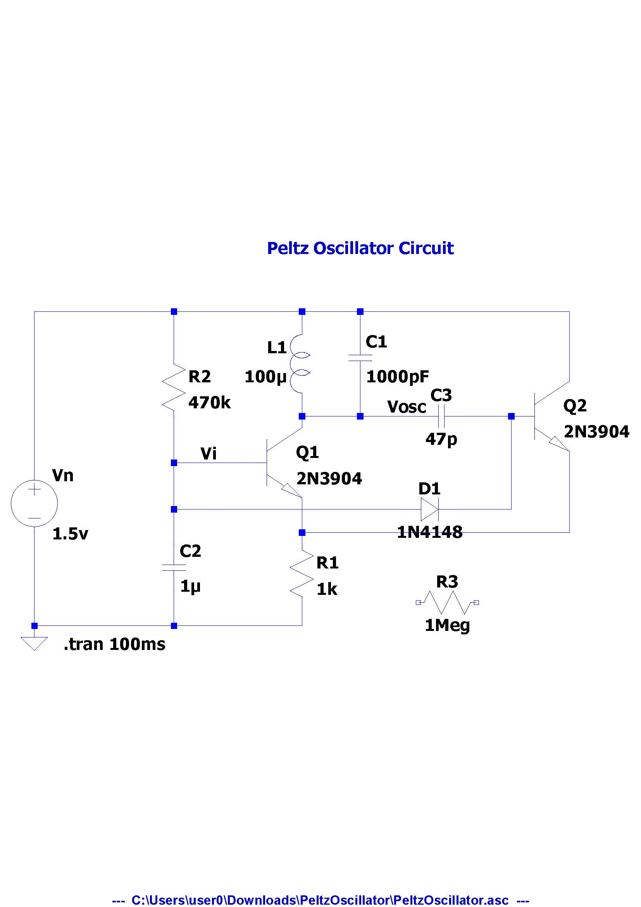
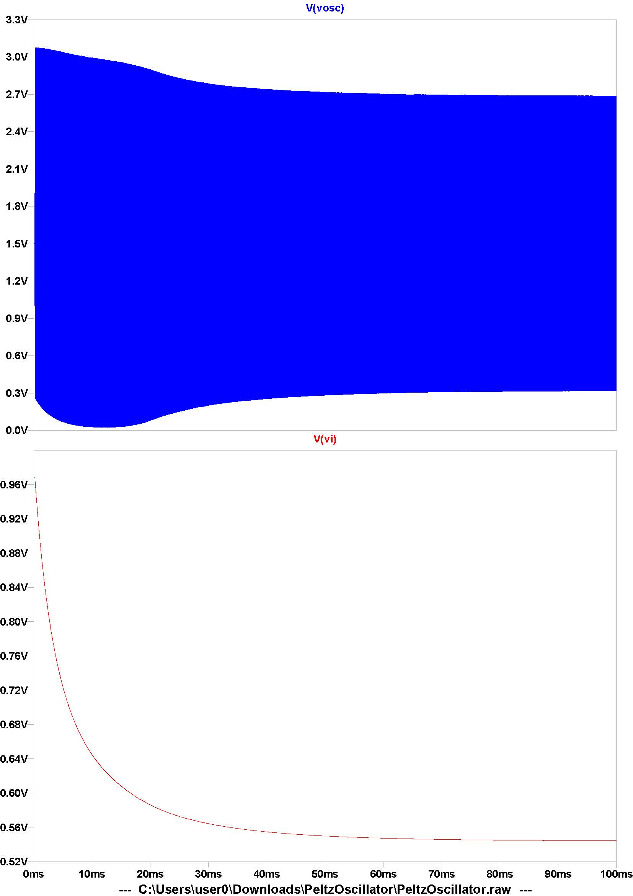

# LTspice_Pletz_oscillator_NPN
LTspice_Pletz_oscillator_NPN, a copy

### sch
 

### plot
  

### source code
[PeltzOscillator.asc](PeltzOscillator.asc)  
```
Version 4
SHEET 1 880 680
WIRE 0 128 -192 128
WIRE 176 128 0 128
WIRE 256 128 176 128
WIRE 544 128 256 128
WIRE 176 160 176 128
WIRE 256 160 256 128
WIRE 0 192 0 128
WIRE 544 224 544 128
WIRE 176 272 176 240
WIRE 256 272 256 224
WIRE 256 272 176 272
WIRE 320 272 256 272
WIRE 336 272 320 272
WIRE 464 272 400 272
WIRE 480 272 464 272
WIRE 176 288 176 272
WIRE 0 336 0 272
WIRE 80 336 0 336
WIRE 112 336 80 336
WIRE -192 352 -192 128
WIRE 0 400 0 336
WIRE 320 400 0 400
WIRE 464 400 464 272
WIRE 464 400 384 400
WIRE 176 432 176 384
WIRE 544 432 544 320
WIRE 544 432 176 432
WIRE 0 448 0 400
WIRE 176 448 176 432
WIRE -192 560 -192 432
WIRE 0 560 0 512
WIRE 0 560 -192 560
WIRE 176 560 176 528
WIRE 176 560 0 560
WIRE -192 576 -192 560
FLAG -192 576 0
FLAG 320 272 Vosc
FLAG 80 336 Vi
SYMBOL res 160 432 R0
SYMATTR InstName R1
SYMATTR Value 1k
SYMBOL res -16 176 R0
SYMATTR InstName R2
SYMATTR Value 470k
SYMBOL ind 192 256 R180
WINDOW 0 36 80 Left 2
WINDOW 3 36 40 Left 2
SYMATTR InstName L1
SYMATTR Value 100?SYMBOL cap 240 160 R0
SYMATTR InstName C1
SYMATTR Value 1000pF
SYMBOL npn 112 288 R0
SYMATTR InstName Q1
SYMATTR Value 2N3904
SYMBOL npn 480 224 R0
SYMATTR InstName Q2
SYMATTR Value 2N3904
SYMBOL voltage -192 336 R0
SYMATTR InstName Vn
SYMATTR Value 1.5V
SYMBOL cap -16 448 R0
SYMATTR InstName C2
SYMATTR Value 1?SYMBOL cap 400 256 R90
WINDOW 0 0 32 VBottom 2
WINDOW 3 32 32 VTop 2
SYMATTR InstName C3
SYMATTR Value 47p
SYMBOL diode 320 384 M90
WINDOW 0 0 32 VBottom 2
WINDOW 3 32 32 VTop 2
SYMATTR InstName D1
SYMATTR Value 1N4148
TEXT 128 40 Left 2 ;Peltz Oscillator Circuit
TEXT -152 584 Left 2 !.tran 100ms

```

